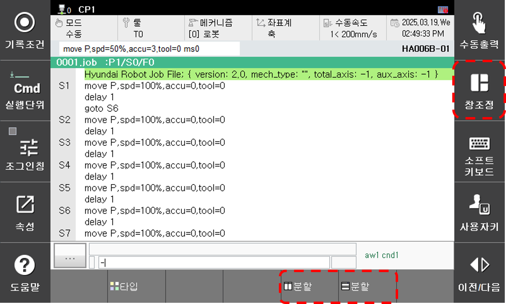
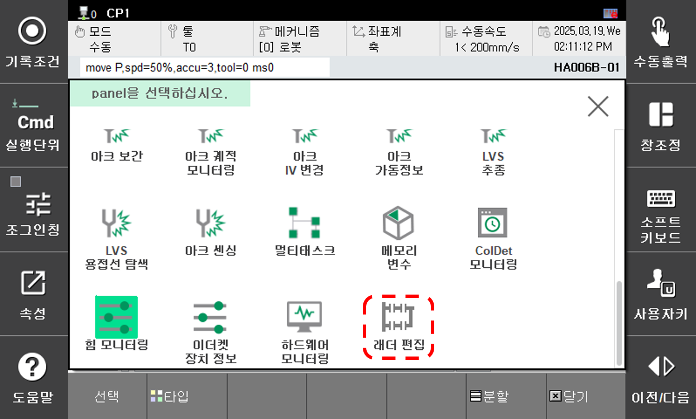
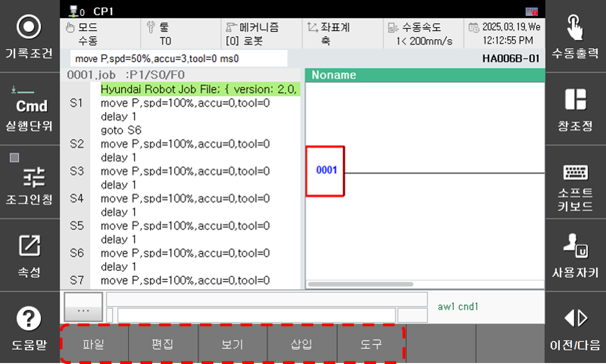

# 2.1. 초기 화면
래더 편집 기능을 실행해보겠습니다.

1. 화면 우측의 [창조정] 버튼과 하단의 [분할] 버튼을 터치한 후 왼쪽 하단의 [선택] 버튼까지 순서대로 터치 하십시오. 패널 선택창이 나타납니다. 

  
2. 패널 선택창에서 래더 편집을 선택합니다. 
  
3. 래더 편집 기능이 시작됩니다.  
하단 버튼바가 아래와 같은 형태가 아닌 경우 ESC 버튼을 누르십시오.
 
 
하단의 버튼을 통해 다양한 기능을 사용할 수 있습니다. 
   

버튼별 기능 분류입니다. 
 
<table text-align: center; style="tg">
    <tr>
        <th colspan = 3 style="text-align: center;"> 버튼</th>
        <th style="text-align: center;">기능 </th>
    </tr>
    <tr>
        <td colspan = 3> 파일</td>
        <td > 파일 불러오기, 저장하기 등 파일 관련 기능 </td>
    </tr>
    <tr>
        <td colspan = 3>편집</td>
        <td>실행 취소, 복사, 붙여넣기, 찾기/바꾸기 등 편집 기능</td>
    </tr>
    <tr>
        <td colspan = 3>보기</td>
        <td>전체화면, 브랜치 간격, 태그 형식 등 화면 확인 관련 기능</td>
    </tr>
    <tr>
        <td colspan = 3>삽입</td>
        <td>삽입 가능한 모든 요소들</td>
    </tr>
    <tr>
        <td colspan = 3>도구</td>
        <td>문법검사, 비교, Remote RUN/STOP 등 PLC 모니터링 관련 기능</td>
    </tr>
</table>

