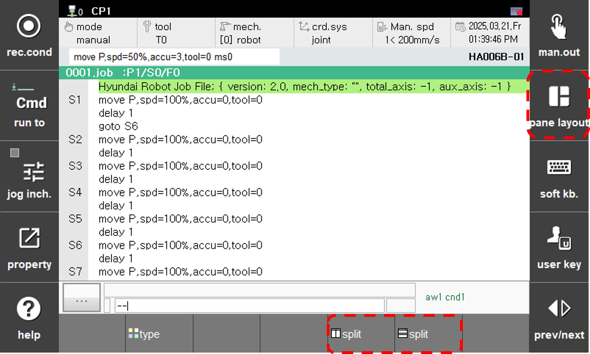
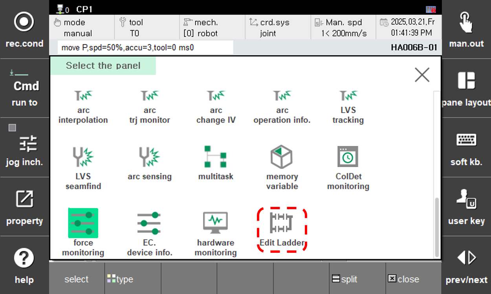
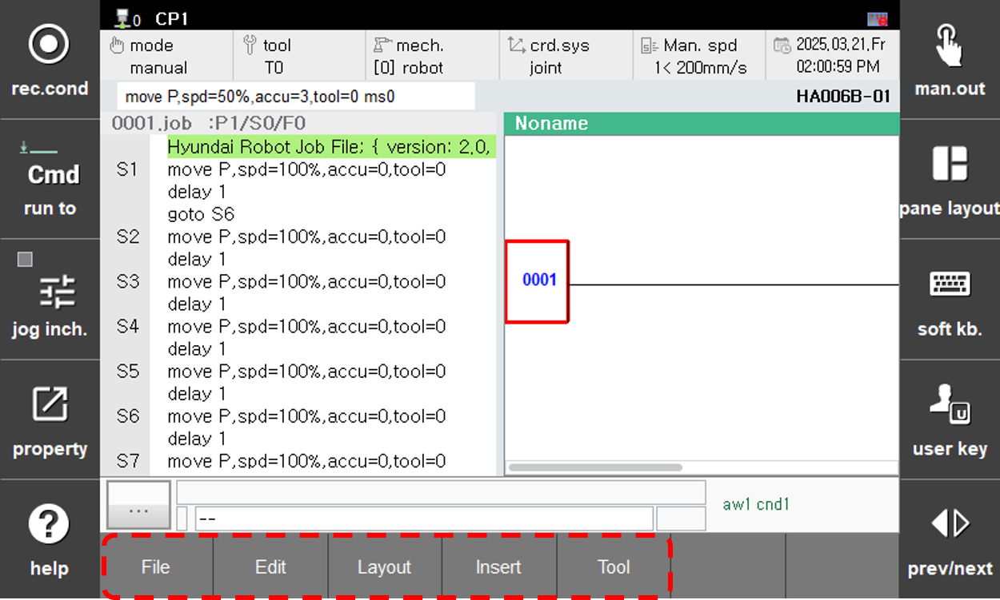

# 2.1. Initial Screen
Let’s execute the Ladder Edit function.

1. Touch the [pane layout] button on the right side of the screen, the [split] button at the bottom, and then the [select] button at the lower left in sequence. The panel selection window will appear.  
    
      

2. Select Edit Ladder in the panel selection window.  
  

3. The Ladder Edit function will start.  
If the bottom button bar is not in the form shown below, press the ESC button.
  
  
You can use various functions through the buttons at the bottom.
   

Here is an explanation of the functions of each button. 
<table text-align: center; style="tg">
    <tr>
        <th colspan = 3 style="text-align: center;"> Button</th>
        <th style="text-align: center;">functions </th>
    </tr>
    <tr>
        <td colspan = 3> File</td>
        <td > File-related functions such as loading and saving files. </td>
    </tr>
    <tr>
        <td colspan = 3>Edit</td>
        <td>Editing functions such as undo, copy, paste, find/replace, etc.</td>
    </tr>
    <tr>
        <td colspan = 3>Layout</td>
        <td>Screen-related functions such as full-screen mode, branch spacing, tag format, etc.</td>
    </tr>
    <tr>
        <td colspan = 3>Insert</td>
        <td>All elements that can be inserted.</td>
    </tr>
    <tr>
        <td colspan = 3>Tool</td>
        <td>PLC monitoring-related functions such as syntax checking, comparison, Remote RUN/STOP, etc.</td>
    </tr>
</table>

