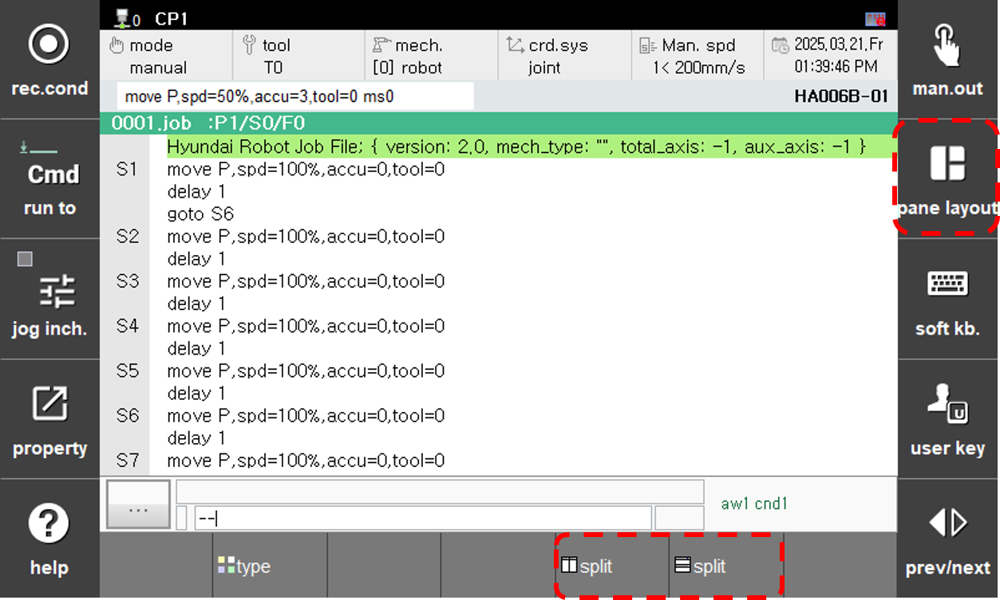
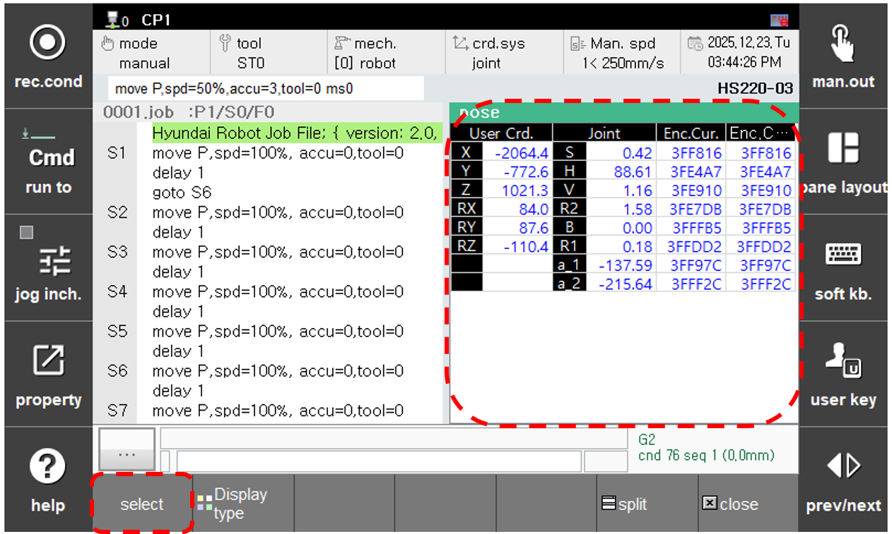
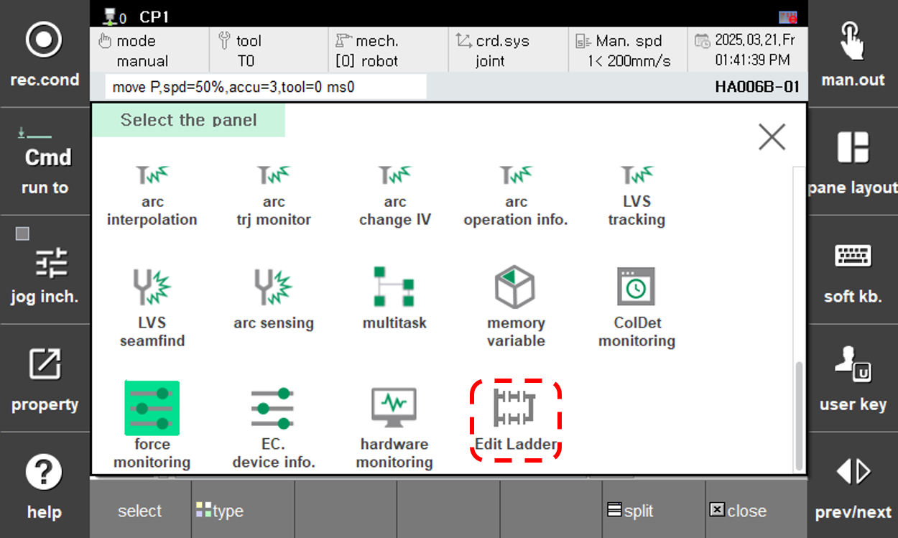
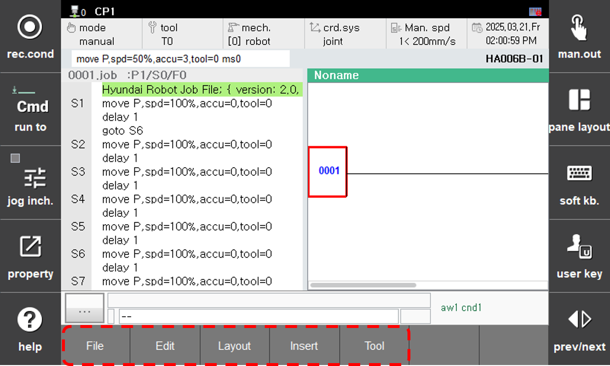

# 2.1. 初始屏幕
让我们执行梯形图编辑功能。

1. 触摸屏幕右侧的 [pane Layout] 按钮和底部的 [split] 按钮。然后，触摸分割监控窗口，接着触摸左下角的 [select] 按钮。面板选择窗口将出现。  
    
    
      

2. 在面板选择窗口中选择编辑梯形图。  
  

3. 梯形图编辑功能将开始。  
如果底部按钮栏不是下方所示的形式，请按 ESC 按钮。
  
  
您可以通过底部的按钮使用各种功能。
   

以下是每个按钮的功能说明。 
<table text-align: center; style="tg">
    <tr>
        <th colspan = 3 style="text-align: center;"> 按钮</th>
        <th style="text-align: center;">功能 </th>
    </tr>
    <tr>
        <td colspan = 3> 文件</td>
        <td > 相关功能，如加载和保存文件。 </td>
    </tr>
    <tr>
        <td colspan = 3>编辑</td>
        <td>编辑功能，如撤销、复制、粘贴、查找/替换等。</td>
    </tr>
    <tr>
        <td colspan = 3>布局</td>
        <td>与屏幕相关的功能，如全屏模式、分支间距、标签格式等。</td>
    </tr>
    <tr>
        <td colspan = 3>插入</td>
        <td>可以插入的所有元素。</td>
    </tr>
    <tr>
        <td colspan = 3>工具</td>
        <td>与 PLC 监控相关的功能，如语法检查、比较、远程运行/停止等。</td>
    </tr>
</table>