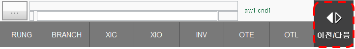

# 3.1 기본 편집
래더 다이어그램을 편집하는 방식은 HRLadder의 편집 방식과 유사하므로 더 자세한 설명은 HRLadder 설명서의 기본 편집 항목을 확인하여 주십시오. 

1. 모든 요소의 삽입은 하단 버튼 바의 삽입 버튼을 통해 확인하실 수 있습니다. 
     
      
    
    다른 요소들을 확인하고 싶다면 이전/다음 버튼을 터치하시면 됩니다. 
      

3. 브랜치 편집을 쉽게 하기 위한 브랜치 간격 옵션입니다. 
    하단 버튼 바 보기 버튼을 누른 후 브랜치 간격 버튼을 누르시면 됩니다. 
     
     