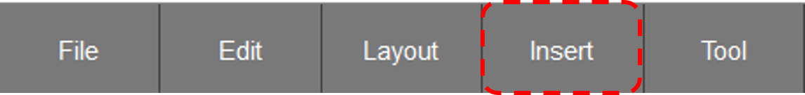
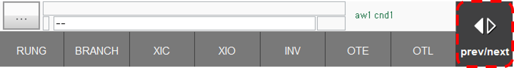

# 3.1 Insert Element
The method of editing the ladder diagram is similar to the editing method of HRLadder, so for more detailed instructions, please refer to the basic editing section in the HRLadder manual.

1. The insertion of all elements can be accessed through the Insert button on the bottom button bar.  
     
      

2. To check other elements, you can touch the prev/next buttons.  
      
