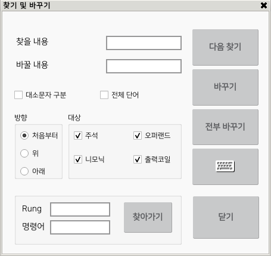

# 3.4 찾기 및  바꾸기
래더 파일의 전체를 검색하여 지정한 문자열을 찾아내거나 찾은 문자열을 지정한 다른 문자열로 바꾸는 기능입니다. 

HRLadder와 동일한 기능이기에 각 항목들에 대한 설명은 HRLadder 설명서의 찾기와 바꾸기 항목을 참고해 주십시오. 

하단 버튼바 편집 > 찾기 및 바꾸기 버튼을 클릭하면 
     
     
 
찾기 및 바꾸기 대화상자가 나타납니다. 
 

  
문자 입력은 전부 바꾸기 버튼 아래의 키보드 버튼을 누른 후 소프트 키보드를 사용하시면 됩니다.
  
