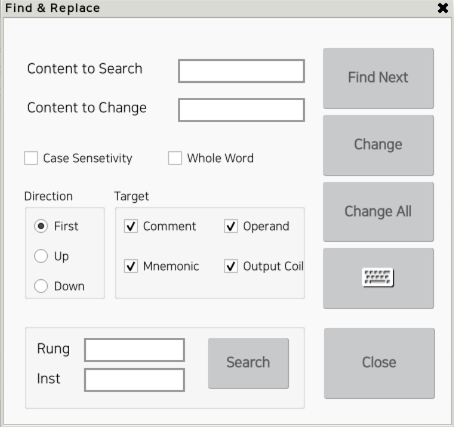

# 3.4 查找和替换
此功能允许您在整个梯形图文件中搜索指定字符串或将找到的字符串替换为另一个指定字符串。 

由于此功能与HRLadder中的相同，因此请参考HRLadder手册中的“查找和替换”部分，以获取每个项目的说明。 

1. 单击底部按钮栏上的编辑按钮，然后单击查找和替换按钮。  
     
     
 
2. 查找和替换对话框将出现。  
 

 要输入文本，请按替换全部按钮下方的键盘按钮，并使用软键盘。

  