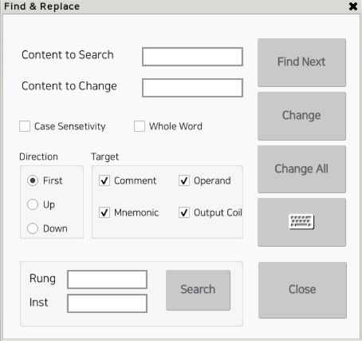

# 3.4 Find and Replace
This function allows you to search the entire ladder file for a specified string or replace the found string with another specified string. 

Since this is the same feature as in HRLadder, please refer to the "Find and Replace" section in the HRLadder manual for explanations of each item. 

1. Click the Edit button on the bottom button bar, then click the Find and Replace button.  
     
     
 
2. The Find and Replace dialog will appear.  
 

 To enter text, press the keyboard button below the Replace All button, and use the soft keyboard.

  
