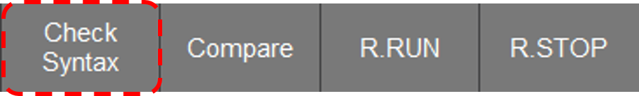

# 3.5 Syntax Check
This function checks if there are any syntax errors in the created ladder diagram.

1. Click the Tool button on the bottom button bar, then click the Check Syntax button.  
     
      

2. If there are errors, a message will pop up showing the total number of errors, the location of the first error, and its details.  
      
    If there are no errors, a message with the text "No Error" will pop up.  
     
