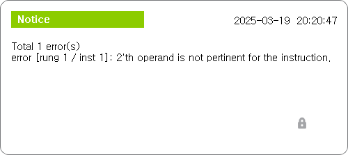

# 3.5 문법 검사
작성된 래더 다이어그램이 문법적으로 틀린 곳이 없는 지 체크하는 기능입니다.

1. 하단 버튼 바 도구 > 문법 검사 버튼을 클릭하십시오.  
     
      

2. 에러가 존재한다면 에러 총 갯수와 첫 에러의 위치 및 내용이 담긴 메시지가 팝업됩니다.  
      
    만약 에러가 없다면 "No Error" 라는 문구가 담긴 메시지가 팝업됩니다.  
     
