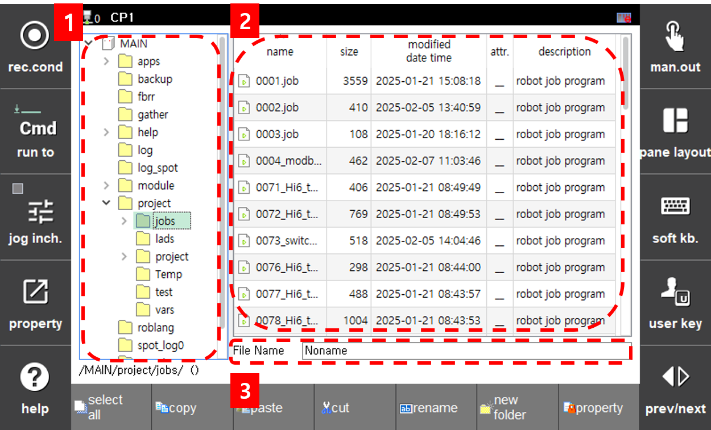
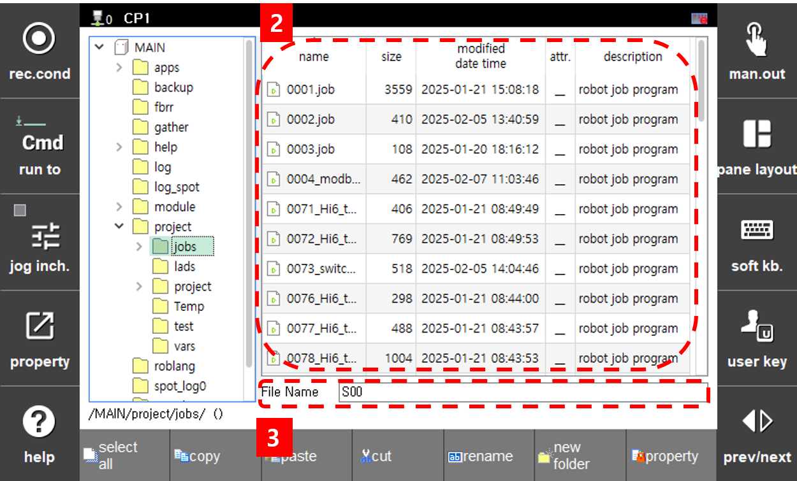

# 3.6.1 文件保存
本节解释如何保存梯形图文件。

1.  按下底部按钮栏上的 文件 > 保存 按钮。  
     
     
    
2. 如果没有语法错误，将出现一个文件管理器屏幕，提供输入文件名的文本字段。  
     
    - 项目 1 是文件目录部分，您可以设置将要保存文件的目录
    - 项目 2 是目录中文件的列表。
    - 项目 3 是文件名输入字段，在此您可以输入要保存的文件名。
3. 在文件名输入字段中，以 S00 格式输入梯形图文件名，然后按 Enter 按钮完成保存。   
      
    
    如果光标集中在目录字段，按 Enter 按钮将不会保存文件。必须在光标集中在项目 2 或项目 3 时按下 Enter 按钮才能保存文件。
    
    
4. 如果您想用不同的名称保存当前文件，可以使用底部按钮栏上的 文件 > 另存为 按钮，以不同的名称保存当前梯形图文件。  

5. 按下梯形图编号保存按钮将显示文件管理器屏幕，文件名输入字段中的文件名格式为 S{Ladder Number}{Additional Description}。  
     
    
    (如果梯形图文件名不符合要求的格式，则文件名将设置为 S00。)