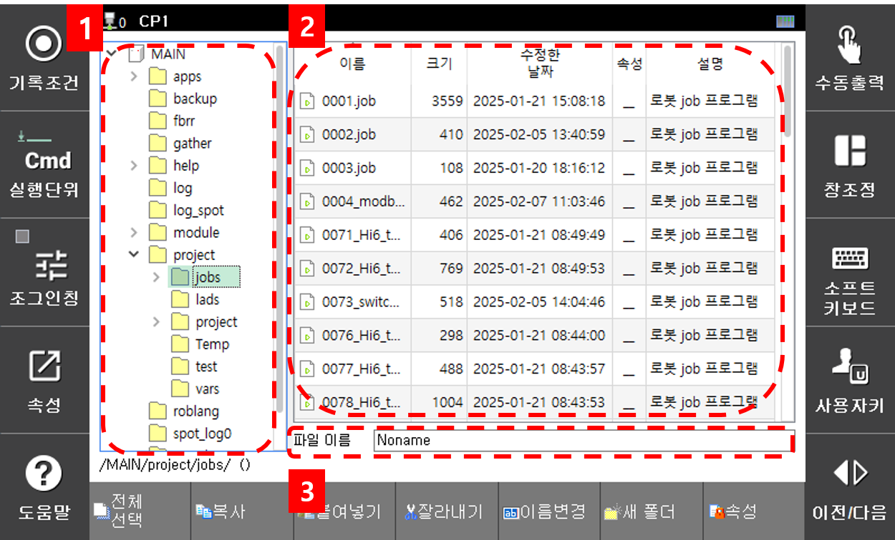

# 3.6.1 파일 저장하기
래더 파일을 저장하는 방법입니다.

1.  하단 버튼 바 파일 > 저장하기 버튼을 누릅니다.  
     
     
    
2. 만약 문법 오류가 없다면 하단의 파일이름을 입력할 수 있는 입력창이 있는 파일 관리자 화면이 나타납니다.  
     
    - 1번 항목은 파일 디렉토리 항목이며 저장 될 디렉토리를 설정할 수 있습니다.
    - 2번 항목은 파일 디렉토리 내부의 파일 리스트 입니다. 
    - 3번 항목은 파일 이름 입력창으로 저장될 파일의 이름을 입력할 수 있습니다.
3. 파일 이름 입력창에 래더 파일 이름 형식에 맞추어 S00 으로 이름을 입력한 후 Enter 버튼을 눌러 저장을 완료하겠습니다.   
      
    
    현재 포커스된 커서가 디렉토리 인 경우 Enter 버튼을 눌러도 저장되지 않습니다. 2번, 3번 항목에 커서를 둔 채로 Enter 버튼을 눌러야 저장이 됩니다.
    
4. 만약 현재 파일을 다른 이름으로 저장하고 싶다면 하단 버튼 바 파일 > 다른 이름 저장 버튼을 통해 현재 래더 파일의 내용을 다른 이름으로 저장할 수 있습니다.  

5. 래더 번호 저장 버튼을 누르면 S{래더번호}{부가 설명} 형태의 파일이름이 파일 이름 입력창에 기록된 파일 관리자 화면이 나타납니다.   
     
    
    (현재 저장하고자 하는 래더파일이 래더 파일 이름 형식에 맞지 않다면 S00으로 파일이름이 지정됩니다.)
