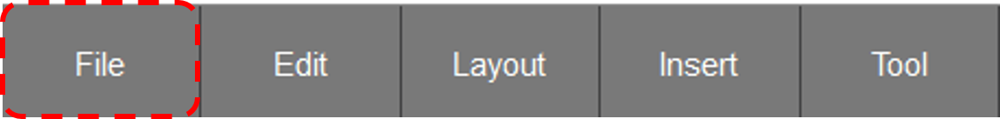
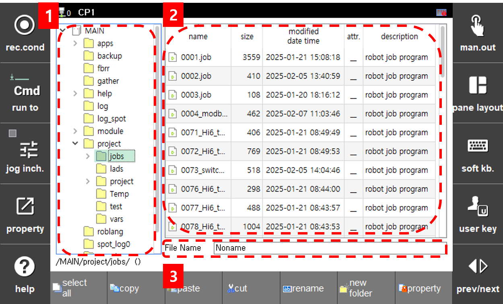

# 3.6.1 File Save
This section explains how to save a ladder file.

1.  Press the File > Save button on the bottom button bar.  
     
     
    
2. If there are no syntax errors, a file manager screen with a text field for entering the file name will appear.  
     
    - Item 1 is the file directory section, where you can set the directory where the file will be saved
    - Item 2 is the list of files in the directory.
    - Item 3 is the file name input field, where you can enter the name of the file to be saved.
3. In the file name input field, enter the ladder file name in the format S00 and press the Enter button to complete the save.   
      
    
    If the cursor is focused on the directory field, pressing the Enter button will not save the file. The Enter button must be pressed while the cursor is focused on either Item 2 or Item 3 to save the file
    
    
4. If you want to save the current file with a different name, you can use the File > Save As Other button on the bottom button bar to save the current ladder file with a different name.  

5. Pressing the Ladder Number Save button will display a file manager screen with the file name in the format S{Ladder Number}{Additional Description} in the file name input field.   
     
    
    (If the ladder file name does not match the required format, the file name will be set to S00.)

