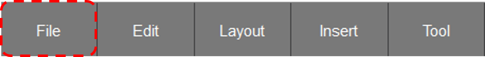
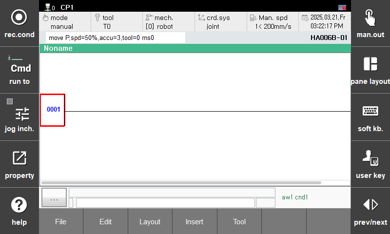
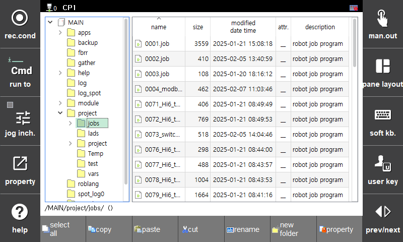

# 3.6.2 File Load
Let's verify if the file has been saved correctly using the File Load function.

1. First, press the File > New File button on the bottom button bar to return to the initial state.  
     
      
     
    
2. Clicking the Load button will open the file manager screen.  
      
      

3. Hover over the saved S00.lad file and press the Enter button. You will see the saved file displayed on the current screen. 

    The file load function only supports loading files with the extension .lad or .LAD.
    
    