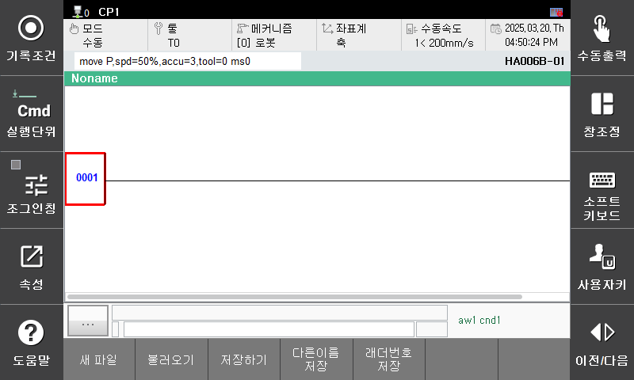
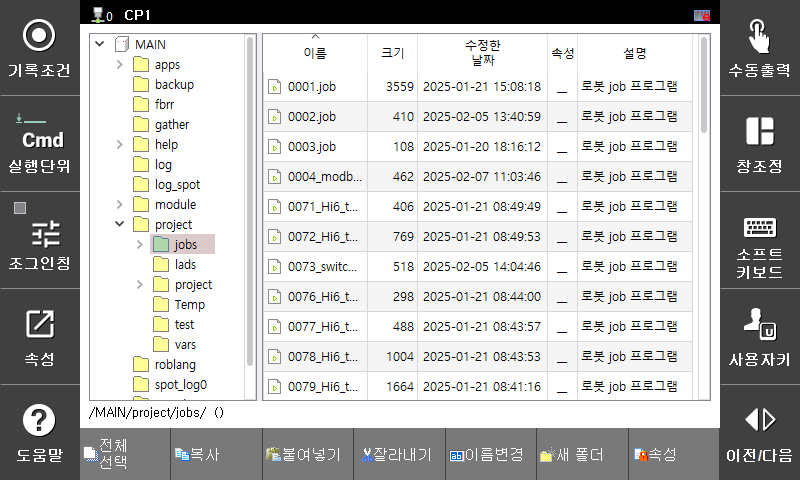

# 3.6.2 파일 불러오기
파일 불러오기 기능을 통해 저장한 파일이 잘 저장되었는지 확인해보겠습니다.

1. 먼저 하단 버튼 바 파일 > 새 파일 버튼을 통해 초기 상태로 돌아가겠습니다. 
     
      
     
    
2. 불러오기 버튼을 클릭하면 파일 관리자 화면이 나타납니다. 
      
     

3. 저장한 S00.lad 파일에 커서를 두고 Enter 버튼을 누르면 현재 화면에 저장한 파일이 출력되는 것을 확인할 수 있습니다. 

    파일 불러오기 기능을 통해서 확장자가 lad 혹은 LAD 인 파일만 불러올 수 있습니다.
    
    