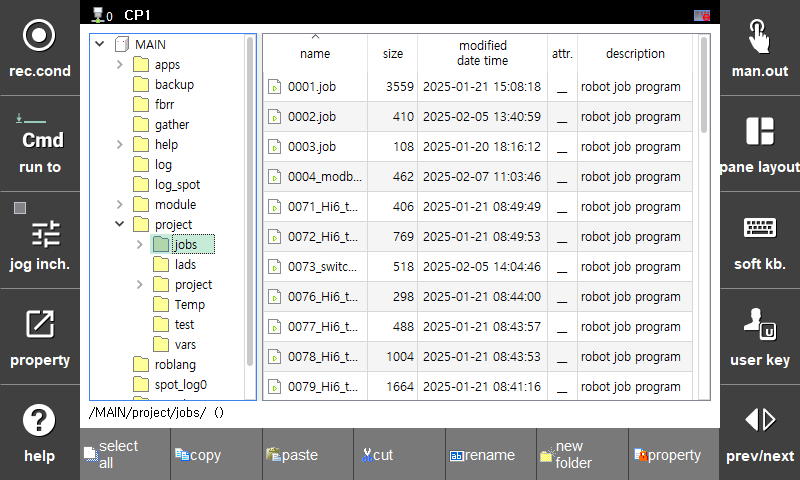

# 3.6.2 文件加载
让我们验证文件是否已通过文件加载功能正确保存。

1. 首先，按下底部按钮栏上的 文件 > 新文件 按钮以返回初始状态。  
     
      
     
    
2. 点击加载按钮将打开文件管理器屏幕。  
      
      

3. 将鼠标悬停在保存的 S00.lad 文件上并按下回车按钮。您将在当前屏幕上看到保存的文件显示。 

    文件加载功能仅支持加载扩展名为 .lad 或 .LAD 的文件
    
    