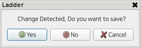

# 3.6.3 New File
If you want to create a new ladder file or return to the initial state of the ladder editing function, you can use the New File function.

1. Press the File > New File button on the bottom button bar.  
     
      
2. This is the result after executing the New File button.  
     
    
3. If you are editing a ladder file and use the New File function, a pop-up will appear asking if you want to save the changes.  
     
    - If you click Yes, you will be taken to the file save screen. If the file is already saved, the changes will be applied to the file.
    - If you click No, the state will change to a new file.
    - If you click Cancel, the new file function will be canceled.

