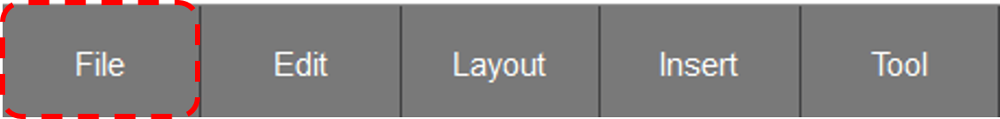
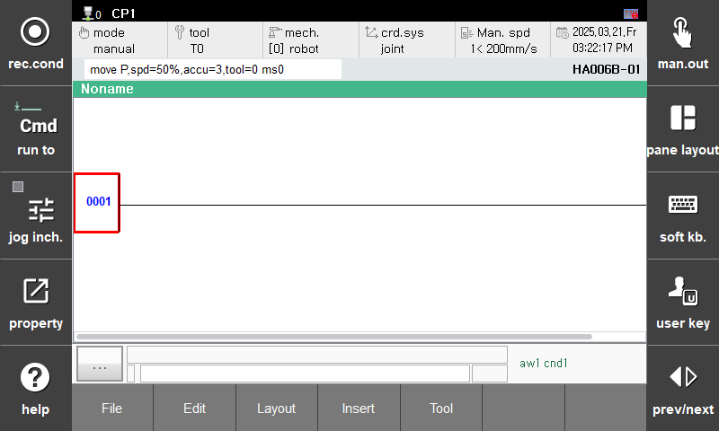
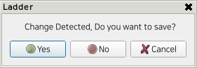

# 3.6.3 新文件
如果您想创建一个新的梯形图文件或返回梯形图编辑功能的初始状态，可以使用新文件功能。

1. 按下底部按钮栏上的 文件 > 新文件 按钮。  
     
      
2. 这是执行新文件按钮后的结果。  
     
    
3. 如果您正在编辑一个梯形图文件并使用新文件功能，将弹出一个询问是否保存更改的窗口。  
     
    - 如果您点击是，将转到文件保存屏幕。如果文件已经保存，修改将应用到文件。
    - 如果您点击否，状态将更改为新文件。
    - 如果您点击取消，将取消新文件功能。