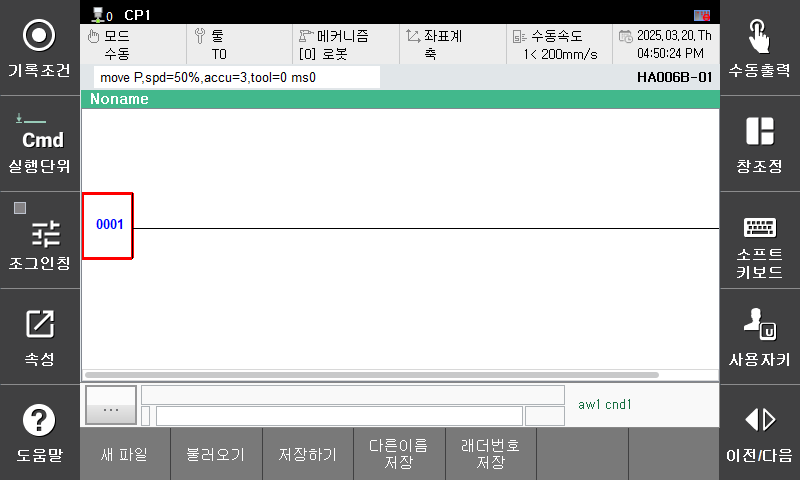

# 3.6.3 새 파일
새로운 래더 파일을 만들고 싶거나 초기 상태의 래더 편집 기능으로 돌아가고 싶은 경우 새 파일 기능을 사용할 수 있습니다. 

1. 하단 버튼 바의 파일 > 새 파일 버튼을 눌러보겠습니다.  
     
      
2. 새 파일 버튼을 실행한 결과 입니다.  
     
    
3. 만약 래더 파일을 수정하던 중 새파일 기능을 사용하는 경우 변경 사항 저장 여부를 확인하는 팝업이 생성됩니다.  
     
    - 예를 누르게 되면 파일 저장 화면으로 이동됩니다. 이미 저장된 파일인 경우 변경 사항이 파일에 적용됩니다.
    - 아니요를 누르게 되면 새 파일 상태가 됩니다.
    - 취소를 누르게 되면 새파일 기능 호출이 취소됩니다.

