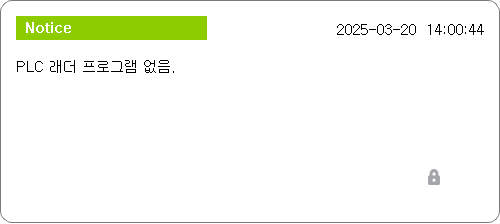
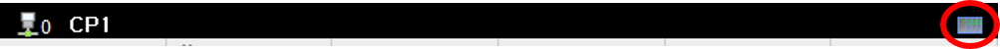

# 4.1. PLC 모니터링
로봇제어기의 내장 PLC의 현재 릴레이값 상태를 모니터링 하는 기능입니다. 

  
- 모니터링 결과는 HRLadder와 동일하므로 자세한 설명은 HRLadder 설명서를 참고해 주십시오. 
- 내장 PLC 동작 모드에 대한 자세한 설명은 [Hi6 내장 PLC 설명서](https://hrbook-hrc.web.app/#/view/doc-hi6-embedded-plc/korean/2-rc-setting/1-plc-mode-set)를  참고해 주십시오.  


하단 버튼 바 도구 > R.RUN 혹은 R.STOP 버튼을 통해 내장 PLC의 동작모드를 Remote Run 혹은 Remote Stop 상태로 변경할 수 있습니다. 
 
 

Remote Run 상태로 PLC 모드를 변경하는 할 때. S00.lad 파일이 main의 project/lads 디렉토리 내에 없거나 S00.lad 파일에 문법적 오류가 있는 경우 래더 파일이 로드 되지 않아 "PLC 프로그램 없음" 이라는 메시지를 출력합니다.  
 

만약 문법적 오류가 없는 S00.lad 파일이 main의 project/lads 경로에 존재한다면 내장 PLC 모드는 Remote Run으로 변경되며 TP화면 우측 상단에 아이콘이 생기는 것을 볼 수 있습니다. 
 

내장 PLC가 STOP 혹은 Remote STOP인 상태에서는 오퍼랜드의 모니터링 값이 표시되지 않습니다. 
  

