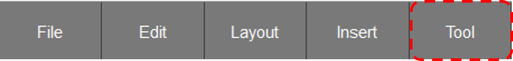
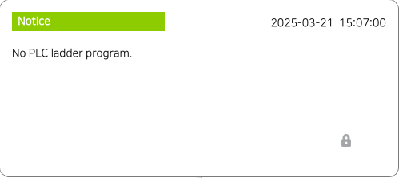

# 4.1. PLC 监控
此功能监控机器人控制器内置PLC的当前继电器值状态。 

  
- 监控结果与HRLadder中相同，请参阅HRLadder手册以获取更详细的说明。 
- 有关内置PLC操作模式的更多信息，请参阅[${cont_model} 嵌入式PLC手册](https://hrbook-hrc.web.app/#/view/doc-hi6-embedded-plc/zh/2-rc-setting/1-plc-mode-set?cont_model=${cont_model})



1. 您可以通过按下底部工具栏上的R.RUN或R.STOP按钮将内置PLC的操作模式更改为远程运行或远程停止。  
     
     

2. 当将PLC模式更改为远程运行时，如果在main/project/lads目录中不存在S00.lad文件或S00.lad文件包含语法错误，阶梯文件将无法加载，并且会出现“没有PLC阶梯程序”的消息。   
     

3. 如果在main/project/lads目录中存在S00.lad文件且没有语法错误，内置PLC模式将切换为远程运行，您将看到一个图标出现在TP屏幕的右上角。  
      

4. 当内置PLC处于停止或远程停止模式时，操作数监控值将不会显示。  
      