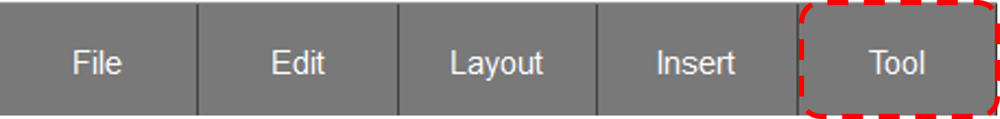

# 4.1. PLC Monitoring
This function monitors the current relay value status of the robot controller's built-in PLC. 

  
- The monitoring results are the same as in HRLadder, so please refer to the HRLadder manual for more detailed explanations. 
- For more information on the built-in PLC operation mode, please refer to the [Hi6 Embedded PLC Manual](https://hrbook-hrc.web.app/#/view/doc-hi6-embedded-plc/korean/2-rc-setting/1-plc-mode-set)



1. You can change the built-in PLC's operation mode to Remote Run or Remote Stop by pressing the R.RUN or R.STOP buttons on the bottom button bar.  
     
     

2. When changing the PLC mode to Remote Run, if the S00.lad file is not present in the main/project/lads directory or if the S00.lad file contains syntax errors, the ladder file will not load, and a message saying "No PLC ladder program" will appear.   
     

3. If the S00.lad file exists in the main/project/lads directory and there are no syntax errors, the built-in PLC mode will switch to Remote Run, and you will see an icon appear at the top right of the TP screen.  
      

4. When the built-in PLC is in STOP or Remote STOP mode, the operand monitoring values will not be displayed.  
      

