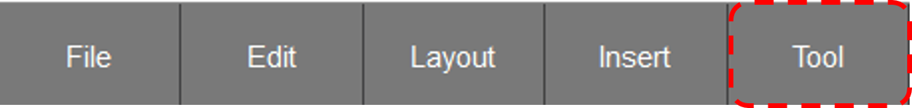
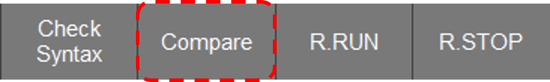

# 4.2 Checksum Compare
When the built-in PLC is in RUN or Remote Run mode, a checksum comparison function is provided to compare the currently viewed ladder diagram with the file downloaded to the built-in PLC.  

1. If the currently viewed ladder diagram is different from the file downloaded to the built-in PLC, a "difference" indicator (<>) will appear next to the title at the top of the monitoring window. 
     

2. If the ladder diagram is the same as the file downloaded to the built-in PLC, a "same" indicator (=) will appear next to the title at the top of the monitoring window. 
     

3. You can also directly perform the checksum comparison by pressing the Compare button in the Tools section of the bottom button bar.   
     
     

