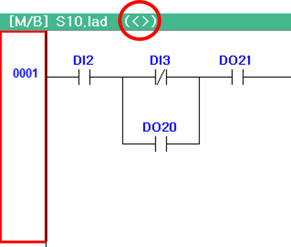
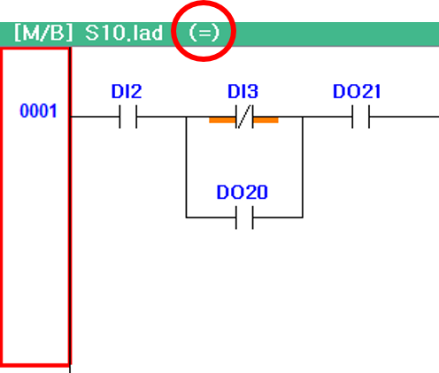

# 4.2 체크섬 비교
내장 PLC가 RUN 혹은 Remote Run 상태인 경우, 현재 확인 중인 래더 다이어그램과 내장 PLC에 다운로드된 파일을 비교해주는 체크섬 비교 기능을 제공합니다.  

1. 만약 현재 확인 중인 래더 다이어그램이 내장 PLC에 다운로드 된 파일과 다르다면 모니터링 창 상단 제목 옆에는 다르다는 표시(<>) 가 표시됩니다. 
     

2. 래더 다이어그램이 내장 PLC에 다운로드된 파일과 같다면 그림 4.7과 같이 같다는 표시 (=) 가 표시됩니다. 
     

3. 하단 버튼 바 도구 > 비교 버튼을 통해서도 직접 체크섬 비교가 가능합니다.   
     
     

