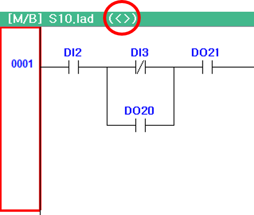
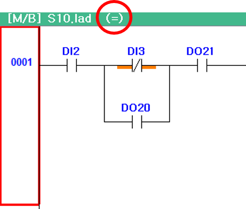

# 4.2 校验和比较
当内置PLC处于运行或远程运行模式时，提供了校验和比较功能，以比较当前查看的梯形图与下载到内置PLC的文件。 

1. 如果当前查看的梯形图与下载到内置PLC的文件不同，“差异”指示器 (<>) 将出现在监控窗口顶部标题旁边。 
     

2. 如果梯形图与下载到内置PLC的文件相同，“相同”指示器 (=) 将出现在监控窗口顶部标题旁边。 
     

3. 您还可以通过按工具条底部按钮栏中的比较按钮直接执行校验和比较。  
     
     